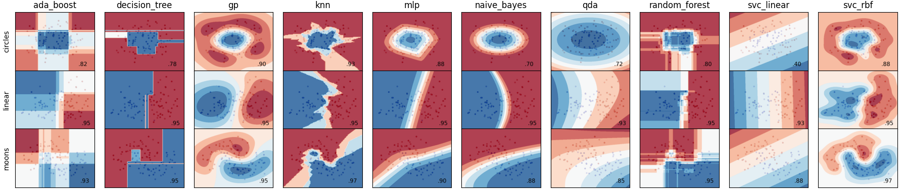

Learn `hydra-zen`
======

***Sandbox to learn and explore the Python library `hydra-zen`***

Francisco Camargo

# Learn Hydra Zen

Will use this repo as a sandbox to experiment using `hydra-zen`

# Open questions

* [ ] hydra store

  * [X] save something to the store in one `.py` file, and then use it in another
  * [ ] what the heck is going on in the `if __name__ == '__main__'` section of example code?
    * [X] is this how the datasets and model classes actually get saved to the store?
    * [ ] What's the deal with `version_base`?
  * [X] `hydra_zen.store()` vs `hydra_zen.ZenStore.add_to_hydra_store`
  * [X] how do I clear the store?
* [ ] Tutorial: Design a Hierarchical Interface for an Application

  * [ ] Run without decorator
  * [ ] Run using `launch()`
* [ ] how do I experiment

  * [ ] control which models to use
    * [ ] control which hyperparameters to use
    * [ ] control a GridSearchCV run
    * [ ] control a run over a specified list of values for a hyperparameter
  * [ ] control which data to use
  * [ ] control what data to plot

# View config info via CLI

To view the same contents as what will appear in `/outputs/*/*/.hydra/config.yaml` you can run

```shell
python my_app.py --info
```

where we have used the `--info` flag

Can view the configurable aspects of our application using the `--help` command

```shell
python my_app.py --help
```

This tells us the fields that the app requires

# Hydra CLI

* Override Grammar: [link]([https://hydra.cc/docs/advanced/override_grammar/basic/](https://hydra.cc/docs/advanced/override_grammar/basic/)) and [link]([https://hydra.cc/docs/advanced/override_grammar/extended/](https://hydra.cc/docs/advanced/override_grammar/extended/))
* CLI flags: [link]([https://hydra.cc/docs/advanced/hydra-command-line-flags/](https://hydra.cc/docs/advanced/hydra-command-line-flags/))
* Defaults List: [link]([https://hydra.cc/docs/advanced/defaults_list/](https://hydra.cc/docs/advanced/defaults_list/))

# Rerun run via CLI

Running hydra applications, [link](https://hydra.cc/docs/advanced/hydra-command-line-flags/)

```Python
python my_app.py -cp outputs/2021-10-27-15-29-10/.hydra/ -cn config
```

`-cp` or `--config-path` allows for override of the path specified in `hydra_main()`
`-cn` or `--config-name` allows for override of the config name specified in `hydra_main()`

## Odd behaviour

I am noticing that I can get this to work if in `hydra_main()` I specify `config_path` to be _any_ string, doesn't matter what the value of the string is, just give `config_path` a string value. Setting `config_path=None` doesn't work, nor does excluding `config_path` from the `hydra_main()` settup.

Look at the top of file `src/5_experiments/my_app0.py` for more details. For the moment it seems like the move is to set `hydra_main(config_path="."`

# Rerunning Experiments

How do I rerun a previous experiment? What's the best way to modify a previous experiment? [link](https://mit-ll-responsible-ai.github.io/hydra-zen/how_to/configuring_experiments.html)

# Working directory

Still trying to get my head around how the directory situation is/needs to be handled. [Here ](https://mit-ll-responsible-ai.github.io/hydra-zen/how_to/using_scikit_learn.html#id1)is one example that has the `hydra-zen` code in a subfolder yet the artifacts from having run the code are saved to `/outputs/` or `/multirun/`

```python
if __name__ == "__main__":  
    from hydra.conf import HydraConf, JobConf
    # Configure Hydra to change the working dir to
    # match that of the output dir
    store(HydraConf(job=JobConf(chdir=True)), name="config", group="hydra")
```

[Reference ](https://hydra.cc/docs/upgrades/1.1_to_1.2/changes_to_job_working_dir/)from Hydra

# Making configs

hello

1. `hydra_zen.make_config`
2. `hydra_zen.builds()`
3. Implicitly via `@store` decorator
4. `hydra_zen.make_custom_builds_fn()`

# Learning to use `hydra_zen.store()`

[docs](https://mit-ll-responsible-ai.github.io/hydra-zen/generated/hydra_zen.ZenStore.html)

There are multiple ways to end up with configs

1. Without the `store()`
   1. Use `make_config()` which is then fed to `launch()`, [link](https://mit-ll-responsible-ai.github.io/hydra-zen/tutorials/basic_app.html)
   2. Use `builds()` on a function or object, and is then fed to `launch()`, [link](https://mit-ll-responsible-ai.github.io/hydra-zen/tutorials/basic_app.html)
2. With the `store()`,
   1. Add config to `store()` using a function decorator, [link](https://mit-ll-responsible-ai.github.io/hydra-zen/tutorials/add_cli.html)
      1. How to I access the config so that I can use `launch()`? At the moment it seems like if I use the decorator, I have to run the app via the CLI
   2. Add config to `store()` while using groups and then add "parent" config with `store(make_config())`, [link](https://mit-ll-responsible-ai.github.io/hydra-zen/how_to/using_scikit_learn.html)
   3. Always end with `store.add_to_hydra_store()` (which adds local store to global store)?

# Launching application

There are multiple ways to launch an application

1. Execute `launch()`, [link](https://mit-ll-responsible-ai.github.io/hydra-zen/tutorials/basic_app.html). Feed the function a config and a task function that takes as input a config
2. Execute `launch()`, [link](https://mit-ll-responsible-ai.github.io/hydra-zen/tutorials/basic_app.html). Feed the function a config and a `zen()` wrapped task function
3. From CLI
   1. Use `hydra_main()` method of a `zen()` wrapped task function to enable CLI usage, [link](https://mit-ll-responsible-ai.github.io/hydra-zen/tutorials/add_cli.html)
   2. 

# scikit_learn_howto

Following [this](https://mit-ll-responsible-ai.github.io/hydra-zen/how_to/using_scikit_learn.html) guide.

To run all experiments via CLI:

```shell
python src/scikit_learn_howto/my_app.py "dataset=glob(*)" "classifier=glob(*)" --multirun
```

seems like the `--multirun` option is needed to enable the `glob(*)` syntax

To run plotter code in CLI

```shell
python src/scikit_learn_howto/plotter.py
```

These two scripts are meant to be run in tandem, that is, if you run the experiment code multiple times, the plotter will likely not work. In this case, the easy fix is to delete the multirun folder and start the experiments over again.

If successful, you should see the following plot:



# scikit_learn_fc

Here I will make changes to the scikit_learn_howto from the previous section

To run a single combination of data and classifier, can do the following:

```shell
python src/scikit_learn_fc/my_app_fc.py "dataset=moons" "classifier=knn"
```

where I have chosen the moons data and the knn classifier. Note that this will put the results into an `/outputs/` folder
